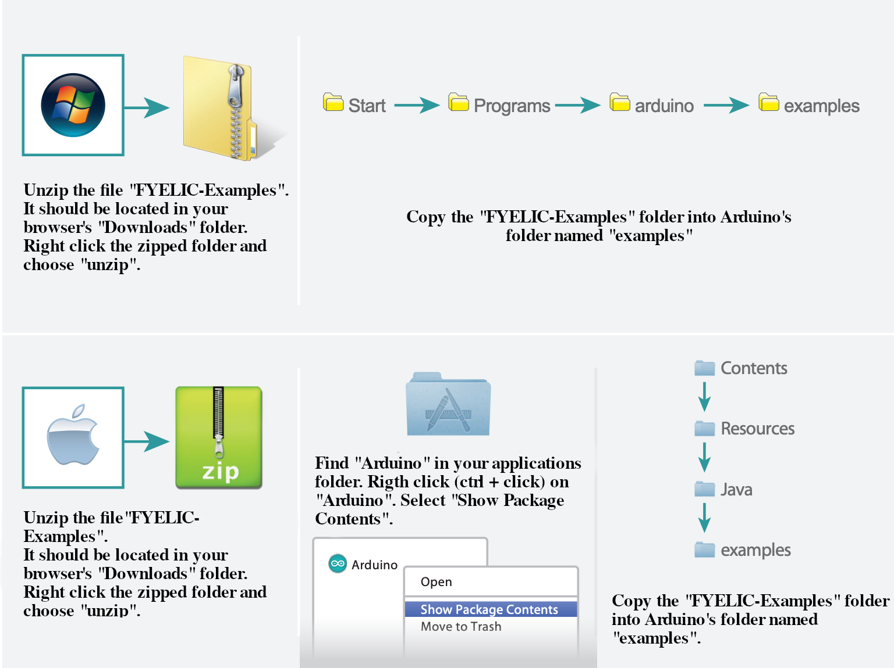

#Table of Contents
- [About](#about)
- [How To Use](#how-to-use)
- [Popular Links](#popular-links)
- [Download Instructions](#download-instructions)
  - [Download Individual Files](#download-individual-files)
  - [Download All Files](#download-all-files)

#About

This collection of Arduino examples and wiring diagrams was created for the First Year Engineering Learning & Innovation Center (FYELIC) at Northeastern University.
Each sketch is named according to that single component used in the sketch. These examples are distinct from the SIK code guide (which is part of the current
curriculum and from which these examples were based) because the SIK examples incorporate several components into a single sketch. To ease in the debugging process
for us tutors at FYELIC and to help with students creating their own Arduino projects, these sketches use singular components.

Many of the components come from the 37 Sensor Kit V 2.0 by Elegoo. Check out https://www.elegoo.com/pages/arduino-kits-support-files and click the "ELEGOO 37 in 1 Sensor Modules Kit" for access to a multitude of resources from which these sketches and wire diagrams were used. It also includes full tutorials for each component beyond the sketches and diagrams provided here.

#How To Use

Here, can find a simple Arduino sketch and accompanying wire diagram for all the components carried by FYELIC. For popular components, check out the [Popular Links](#popular-links) section. Otherwise, you can browse the FYELIC-Examples folder for the full list. **You will need to reference both the Arduino sketch and the wire diagram.** If you wish to download the code and diagram, check out the [Download Instructions](#download-instructions) section for more detail. 

#Popular Links

It might be overwhelming the amount of examples in this library. Here's the links to the sketches for the components included in the standard Sparkfun Inventor's Kit.

| Component name      | Link |
| ----------- | ----------- |
| LED      | [LED](FYELIC-Examples/LED/LED.ino) , [Wiring](FYELIC-Examples/LED/LED.png)  |
| Push Button   | [Button](FYELIC-Examples/Button/Button.ino) , [Wiring](FYELIC-Examples/Button/Button.png)      |
| Potentiometer   | [Potentiometer](FYELIC-Examples/Potentiometer/Potentiometer.ino) , [Wiring](FYELIC-Examples/Potentiometer/Potentiometer.png)       |
| LCD Display   | [LCDDisplay](FYELIC-Examples/LCDDisplay/LCDDisplay.ino) , [Wiring](FYELIC-Examples/LCDDisplay/LCDDisplay.png)       |
| Ultrasonic Distance Sensor   | [DistanceSensor](FYELIC-Examples/DistanceSensor/DistanceSensor.ino) , [Wiring](FYELIC-Examples/DistanceSensor/DistanceSensor.png)  |
| Piezo buzzer  | [Buzzer](FYELIC-Examples/Buzzer/Buzzer.ino) , [Wiring](FYELIC-Examples/Buzzer/Buzzer.png)        |
| Photoresistor   | [Photoresistor](FYELIC-Examples/Photoresistor/Photoresistor.ino) , [Wiring](FYELIC-Examples/Photoresistor/Photoresistor.png)       |
| Temperature Sensor (TMP36)   | [TemperatureSensor](FYELIC-Examples/TemperatureSensor/TemperatureSensor.ino) , [Wiring](FYELIC-Examples/TemperatureSensor/TemperatureSensor.png)       |
| Yellow Gearmotors   | [YellowMotors](FYELIC-Examples/YellowMotors/YellowMotors.ino) , [Wiring](FYELIC-Examples/YellowMotors/YellowMotors.png)       |
| Servo Motor   | [180Servo](FYELIC-Examples/180Servo/180Servo.ino) , [Wiring](FYELIC-Examples/180Servo/180Servo.png)       |
| Switch   | [Switch](FYELIC-Examples/Switch/Switch.ino) , [Wiring](FYELIC-Examples/Switch/Switch.png)       |

#Download Instructions

**Make sure that for whatever sketch you're using, your wiring matches the corresponding diagram. Having perfect code but incorrect wiring (or vice versa) will lead to something not working. Make sure the pin numbers match, you're using the correct supply voltage, the components are oriented correctly, etc.**

##Download Individual Files

Go to the file that you want to download, either by using the links [above](#popular-links) in the Quick Lookup section, or by browsing the examples in the FYELIC-Examples folder.

For code files, right click the "Raw" button and choose "Save Link As..." to download the .ino file to your computer.

For wire diagrams, right click the "Download" button and choose "Save Link As..." to download the image to your computer.

##Download All Files
Click the green button that says "Code," then click "Download ZIP" to download a zip file of this repository. Once you unzip the file, you can follow these instructions to make the FYELIC-Examples folder accessible in Arduino. Then, you can load any of the sketches as needed, just like you would with the default Arduino examples and the SIK guide.  

